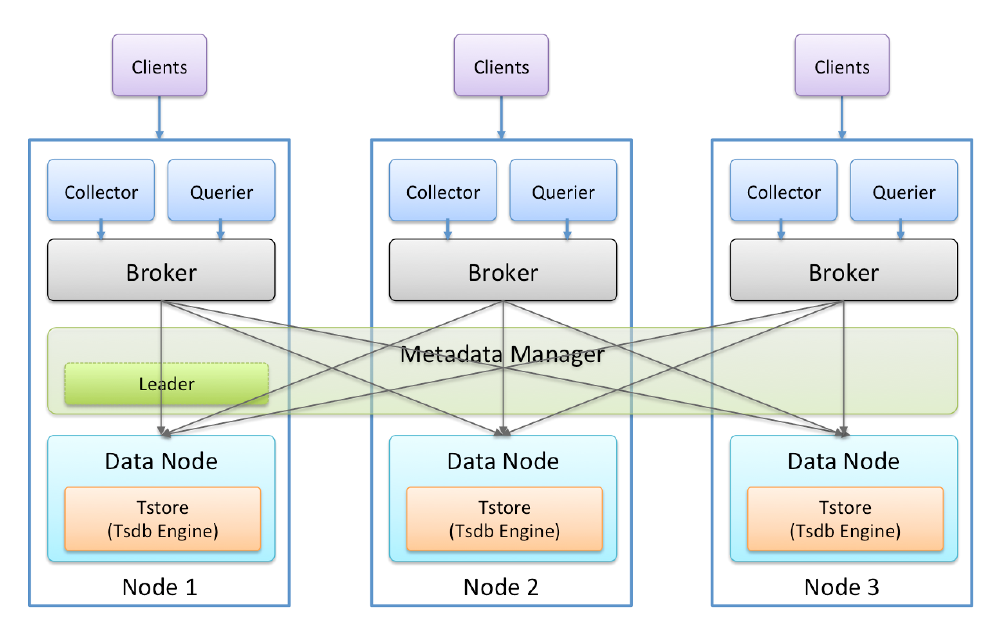
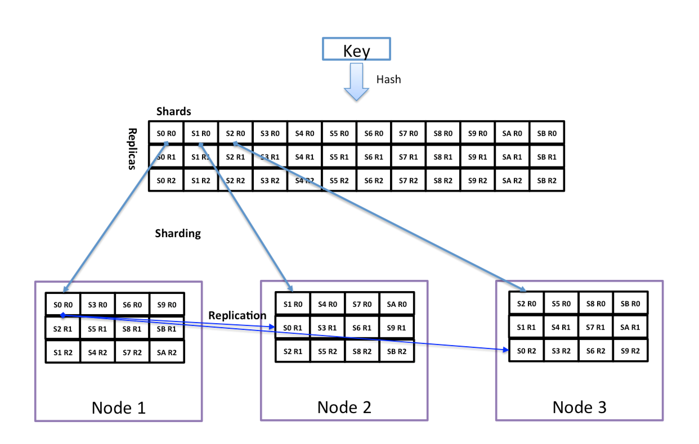
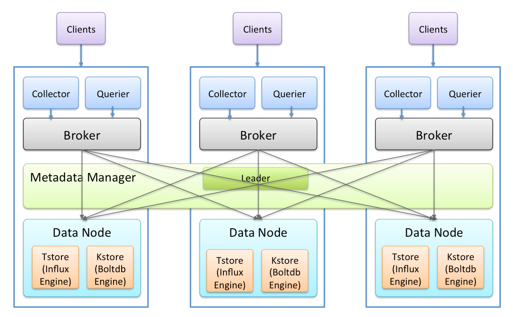

# TSDB clustering

Citadel is a highly available distributed time series database.
It is based on Influxdb storage engine with a scale out layer written on top to shard and replicate time-series data across a cluster of nodes.
In terms of CAP theorem, its an AP system. It implements an eventual consistency model similar to DynamoDB/Cassandra.

[The name is a reference to game of thrones: Citadel stores all historical records]


## Citadel Architecture



Each Citadel node is equal in all aspects, there are no master nodes or worker nodes. Any client can talk to any citadel node and they would get exactly same behavior.
Each citadel node is made up of multiple components.

### Data node
Data nodes are the backend data stores that store one or more shards of data. Data nodes act as gRPC server that perform shard specific operations.

### Tstore
Tstore is a wrapper on InfluxDB storage engine. Data nodes create an instance of Tstore for each Shard/Replica it owns.
Each Tstore instance is a self contained InfluxDB store engine.

### Metadata
Metadata manager is responsible for:
- Discovering all the nodes in the cluster using Etcd.
- assigning shards and replicas to nodes.
- Persisting all state to Etcd in a consistent way.
- Managing node lifecycle and syncing data as required.
- Rebalancing shards and replicas across nodes based on capacity and load.
- Mapping keys to shards and replicas.
- Propagating metadata information to all nodes in the cluster.

### Broker
Broker is responsible for distributing read/write/query operations to appropriate shard.
Broker does this with the help of metadata manager. Broker is a stateless entity that distributes work purely based on metadata information.

## Sharding Concepts
Sharding in Citadel is similar to how most distributed hash table implementations work.
All keys are hashed to a hash bucket and hash buckets are distributed across nodes.



### ShardMap
ShardMap is basically the DHT metadata. Each hash bucket is a shard. Number of shards in a shardmap is fixed for the lifetime of the shardmap.
General guideline is to create K * N shards where N is the max number of nodes planned for the cluster and K is a constant between 3-10. Higher value of K will distribute the load more evenly across the cluster.

### Shard and Replica
Shard represents one hash bucket in the DHT. Each shard can have M replicas based on replication-factor. For example, RF2 will have two replicas. One of the replicas will be considered a primary replica and others are secondary replicas. Primary replica is the source of truth for each shard. Primary replica is also responsible for replicating all operations to secondary replica and syncing data to new replicas when they are added (or disconnect-connect). Replication factor for the database can change over time and metadata manager will adjust the number of replicas accordingly. Metadata manager will also ensure each replica of a shard will be on a different node.

### Cluster
Cluster represents a cluster of nodes. It contains two pieces of information.
1. ShardMap: contains metadata information about shards and replicas.
2. NodeMap: contains metadata information about nodes in the cluster and the shards assigned to it.

### Node
Node is a node in the cluster. Each node contains multiple replicas belonging to different shards.
Each node registers itself to Etcd when it comes up and maintains a TTL based heartbeat(Lease).
This mechanism is used to discover the node in the cluster and detect when the nodes die.

## Read Write Operations

This section walks thru how read/write operations are handled by Citadel.

### Write operation

1. Write operation from the clients arrives at one of the brokers.
2. Broker gets the ShardMap from its local copy of the metadata.
3. Broker hashes the key into shardmap and determines the shard this key belongs to.
4. Broker gets the primary replica of the shard from ShardMap.
5. Broker sends the write request to the DataNode hosting the primary replica.
6. DataNode hosting the primary replica writes the data to local Tstore and replicates the data to each of the secondary nodes.
7. DataNode returns if at least one write was successful. We only guarantee at least one write at this point. A quorum-write feature is in the works.
8. Broker returns success to the client

### Read operation

1. Read request from the clients arrives at one of the brokers.
2. Broker gets the ShardMap from its local copy of the metadata.
3. Broker hashes the key into ShardMap and determines the shard this key belongs to.
4. Broker randomly picks one of the replicas for read operation and sends it to the DataNode hosting the replica. This way read/query load is distributed across all replicas.
5. DataNode serves the read/query request using local Tstore.
6. If request to the DataNode fails, Broker retries other replicas in the shard till one of them is successful.
7. Once the response comes back from DataNode results are sent back to client.
8. Brokers don't support query aggregation across DataNodes yet. This feature is in the works.

### Read aggregation

Query aggregation is done in data node. Each datanode is initialized with a t-store instance for 
query aggregation during start.

1. Read request from the clients arrives at one of the brokers.
2. Broker picks a random Shard from its local copy of the metadata.
3. Broker randomly picks one of the replicas for read operation and sends it to the DataNode
4. DataNode starts a query to all shards, local and remote
5. DataNode aggregates the result and send it back to broker
6. Once the response comes back from DataNode results are sent back to client.

## Running Citadel

```
$ citadel --help
Usage of citadel:
  -db string
    	DB path (default "/tmp/tstore/")
  -http string
    	HTTP server listen URL (default ":7086")
  -kvstore string
    	KVStore URL
  -url string
    	Node URL
  -uuid string
    	Node UUID

```

Running Citadel in Venice vagrant VMs is fairly easy. It just requires a working etcd cluster. One can use `make cluster` to create etcd cluster in vagrant VMs.

On Node1
```
[vagrant@node1 ~]$ make cluster
......
[vagrant@node1 ~]$ citadel
```

On Node2
```
[vagrant@node2 ~]$ citadel
```
Both of these will discover each other using Etcd and form the cluster.
Citadel comes with a built in HTTP server which can be used to perform read/write operations into the cluster
Here are some curl commands that can be used to access the tsdb cluster:

```
# Create database
curl -i -XPOST 'http://localhost:7086/db?db=mydb'

# Read databases
curl -s 'http://localhost:7086/db'

# write points
curl -i -XPOST 'http://localhost:7086/write?db=mydb' --data-binary 'cpu_load_short,host=server01,region=us-west value=0.64 1434055562000000000'

# Query
curl -sG 'http://localhost:7086/query?pretty=true' --data-urlencode "db=mydb" --data-urlencode "q=SELECT * FROM cpu_load_short" | python -mjson.tool

# Query with parameters
curl -sG 'http://localhost:7086/query' --data-urlencode "db=default" --data-urlencode "q=SELECT * FROM  objStats WHERE "reporterID" = 'nmd_00ae.cd00.0540'"

# Information about the cluster
curl -s http://node1:7086/info | python -mjson.tool

# show measurements
curl -d "q=show measurements" -d "db=default" localhost:7086/cmd | python -m json.tool

# show series
curl -d "q=show series" -d "db=default" localhost:7086/cmd | python -m json.tool

# show tag keys
curl -d "q=show tag keys" -d "db=default" localhost:7086/cmd | python -m json.tool

```

## Experimental Features

### Kstore
Kstore is a highly available, distributed key-value store thats optimized for bulk writes and distributed queries.
Kstore was created mostly to demonstrate how Citadel's metadata management is independent of the backend data store and type of data being stored.
In terms of CAP theorem, it is a AP system(While Etcd is a CP system). Main value of Kstore is, its optimized for batch writes and reads.
It can perform hundreds of thousands of read/write operations per second per node and scale linearly with number of nodes. Kstore is meant to be used for running high performance analytics jobs on key-value data.



Kstore uses a Boltdb backend to store the key-value pairs. It uses the same metadata management logic as described above.
There is a separate instance of metadata manager for time-series data(tstore) and key-value data(kstore).
Brokers are extended with Read/Write/List/Delete APIs for batched key-value operations.

Here are some curl commands to access the kvstore API:

```
# List
curl -sG 'http://localhost:7086/kv/list?table=test' | python -mjson.tool

# Put
curl -s -XPOST 'http://localhost:7086/kv/put?table=test' --data-binary 'testKey1=testVal1'

# Delete
curl -s -XPOST 'http://localhost:7086/kv/delete?table=test' --data-binary 'testKey3'

# Get
curl -sG 'http://localhost:7086/kv/get?table=test' --data-urlencode "keys=testKey1" | python -mjson.tool
```

### HTTP Server
There is a basic HTTP server that exposes InfluxDB compatible REST api for time-series data and basic CRUD apis for key-value data.
This is meant to be used for testing purposes. In production systems, we should use gRPC APIs (yet to be defined).

## Using ctchecker to verify data consistency in Citadel

Ctchecker program uses Citadel's REST api to write specified data patterns to Citadel and read it back and verify data has ramained consistent. This is especially useful in verifying data consistency while citadel nodes are coming up and going down.

Examples:

Running `ctchecker -write -tstore -rate 100 -count 10000 -url http://node1:7086,http://node2:7086` will write a unique data pattern to  Citadel's TSDB at 100 points per second and 10K points(i.e, it'll write for 100 seconds).

Running `ctchecker -check -tstore -count 10000 -url http://node1:7086,http://node2:7086` will check all 10K points written to TSDB can be read back consistently and all contents are accurate.

One can run `ctchecker` tests while start/stopping citadel instances and emulating various network events to make sure no data is lost in any case.

```
$ ctchecker --help
Usage of ctchecker:
  -check
    	Check data
  -count int
    	Number of values to write (default 1)
  -kstore
    	Test kstore
  -rate int
    	Rate(values per second) at which to write (default 1)
  -series int
    	Number of series to write (default 1)
  -table string
    	Table to write (default "test")
  -tstore
    	Test tstore
  -url string
    	Comma seperated list of urls (default "http://localhost:7086")
  -write
    	Write data

```
