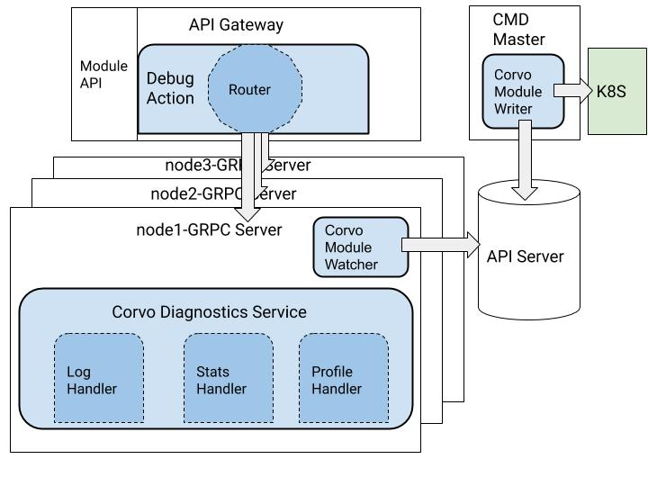

## Corvo Diagnostics Framework

Corvo can be used to get diagnostics information from running process or container.  Each process or container is represented by a Module object. It is currently created in API server by CMD for venice containers.
Currently, any Venice grpc server can include Corvo service. It includes an implementation for a handler to query logs and expvars. One can extend it to define new query and its handler to return custom diagnostics. Examples could be debug stats, profiling information etc.
For an example integration you can look at Spyglass. One can set a log level in module object for Spyglass and query its logs using Debug action.





### Module
**Request**
```
GET https://{{VeniceServer}}:{{VenicePort}}/configs/diagnostics/v1/modules/node1-pen-spyglass
```
**Response**
```
{
    "kind": "Module",
    "api-version": "v1",
    "meta": {
        "name": "node1-pen-spyglass",
        "generation-id": "2",
        "resource-version": "666",
        "uuid": "ce378940-8718-4473-a391-75f9b8461293",
        "creation-time": "2019-05-10T16:26:10.112345874Z",
        "mod-time": "2019-05-10T16:26:27.176632168Z",
        "self-link": "/configs/diagnostics/v1/modules/node1-pen-spyglass"
    },
    "spec": {
        "log-level": "Debug"
    },
    "status": {
        "node": "node1",
        "module": "pen-spyglass",
        "category": "Venice",
        "service": "pen-spyglass-2044869589-3v2dt"
    }
}
```
### Log query on module
**Request**
```
POST https://{{VeniceServer}}:{{VenicePort}}/configs/diagnostics/v1/modules/node1-pen-spyglass/Debug
{
	"query": "Log",
	"parameters":{
		"lines": "300"
	}
}
```
**Response**
```
{
    "diagnostics": {
        "logs": [
            {
                "log": {
                    "@timestamp": "2019-05-10T16:26:07.815Z",
                    "caller": "svc_diagnostics_endpoints.go:488",
                    "duration": "52.865µs",
                    "error": "",
                    "level": "audit",
                    "method": "AutoWatchModule",
                    "module": "pen-spyglass",
                    "msg": "",
                    "pid": "7",
                    "result": "Success",
                    "service": "DiagnosticsV1",
                    "source": "/var/log/pensando/pen-spyglass.log",
                    "ts": "2019-05-10T16:26:07.675716955Z"
                }
            },
            {
                "log": {
                    "@timestamp": "2019-05-10T16:26:10.816Z",
                    "caller": "elastic.go:997",
                    "level": "error",
                    "module": "pen-spyglass",
                    "msg": "request failed, root_cause: [{Type:index_not_found_exception Reason:no such index ResourceType:index_or_alias ResourceId:venice.external.default.configs Index:venice.external.default.configs Phase: Grouped:false CausedBy:map[] RootCause:[] FailedShards:[]}]",
                    "pid": "7",
                    "source": "/var/log/pensando/pen-spyglass.log",
                    "submodule": "elastic-client",
                    "ts": "2019-05-10T16:26:09.85241932Z"
                }
            },
        ]
    }
}
```
### Stats query on module
You can query "cpustats", "memstats", "cmdline" or any expvars that were added. If action is not specified default is get. If expvar is not specified then all expvars are retrieved.
 
**Request**
```
POST https://{{VeniceServer}}:{{VenicePort}}/configs/diagnostics/v1/modules/node1-pen-npm/Debug
     {
     	"query": "Stats",
     	"parameters":{
     		"action": "get",
     		"expvar": "cpustats"
     	}
     }
```
**Response**
```
{
    "diagnostics": {
        "stats": {
            "cpustats": "{\"NumCPUs\":16,\"NumGoroutines\":170,\"NumCgoCalls\":1}"
        }
    }
}
```
### Profile query on module
You can query "goroutine", "heap", "block", "mutex", "allocs", "threadcreate", "cmdline". [Refer golang pprof](https://golang.org/src/runtime/pprof/pprof.go?s=5216:5356#L123)
 
**Request**
```
POST https://{{VeniceServer}}:{{VenicePort}}/configs/diagnostics/v1/modules/node1-pen-npm/Debug
{
	"query": "profile",
	"parameters":{
		"profile": "goroutine"
	}
}
```
**Response**
```
{
    "diagnostics": {
        "buffer": "H4sIAAAAAAAE/7R7e3wUVbbu3SFNNh0kiyCwQB5F+epE7TYFIr7lDQqCSSAqYqx0Kp0ynaqmqjohPoOK8hIFZ+SoZ9TxcZxRZ9QzMzr4xOeoOI6vGREYmadzHBlGPXq853qP3N/auzpdnXSTDnj/geq91v7Wt9dee+1nLirlDEouZWHxvwqc4d0P3VSihjiDx0qAVXPOYBAOUkpV4CX4f+7ZVKKGeAlslbISCGFIGawCH4T3PfVmqRrig2BfSNQbBGVYpnAVeCn+dq+QlcJDsl4pDMEhSriSw4RwKSsZROgh3Lp6A1kOwU2DBEIIyrFcGaoCH4zXf76eZIPhl0zIBsNheJgyVK3gZXj/2p+XqKW8DBqEqAyG4TClQq3gHO/6kRBxuFiIOACCUqECH4LdJArxIfBjiTgEhuNwpVIFHsbnnvwHWQvDG1IWhhE4QjlcBV6OD/7iC5KVZ5iUw0gcqYxSgQ/Ff76+fpAa4kNhw2BhbyiMxtEKqsAPw589uI3qHQZvSszDYAyOUcaqwIfh02+JesPgXllvGByBR4h6FXjr7UJWAX8sFZgVMA7HCRlg910byB7AC1IGMB7HC9lwXC9lw+FvQ0S94TABJwhZJW79cidxqYQ/SS6VMBEnKooKfATetvlnJBsBT8i+GgGTcJKiqsAPxyd++wz18eHwupQdDkfikUI2Ej95X8hGwj8k5kg4Co9SjlaBj8J7PhayUbBX9uwoOAaPEbLRuPG51whzNHzEBc/RcCweq4QrEcaHD2ehwWV8SLh86GHDKmB45YjDR44arQJHfPCla4klZlgiRDAionQM/s+L15JsDGyQXhkDVVilVKvAx+LfnxGysXCbZDIWjsPjhOwIfPXe/wyrIX4ErJctOAKOx+OVEyqHwLhwiOGYsUeowMfhQ88KiHFwp4QYB1GMKtVqBR+Pd7/8dqlayseDK9oyHmIYU07sQRg3Xq3gE/CTe4TWBEgLrQlQgzWKVlkG48KDWMkEFfhEfPLrd8ktE+HLMqE0ESbjZGWKClzBrU9+QDIFnpdDTYGT8CRlSiWHcTScJlJHTsJvPxGOnQTfygCYBFNxqhKuLIPRZGaSClzF+/YKKBX2yzarcDKerEyrLIMwKVG3H4lf3/8V2TsSvpHdfiScgqcop1YOAS4cM+5IFfhR+MHHvsGbwsAqy6CMEI5SgR+N//2ESBxHwV2yS46C0/A0kTiOwT23P0rddTT8Yrho6dFwOp6unKFW8GPx8b8+Va6W8mOgTYiOgTPxTOUsFXgEv/76qXI1xI+FmyTzY+FsPFs5qzIMpeHBrOToY46NqMCrcMu324l8BFZLvQhMx+kKVyt4Na797+3UXVVwuYCvghk4Q6Ss4/Avd4qUVQ23yl6uhpk4U8iOx3+7Q8jkMFCBn4Af3y5KjoPrpPZxMAtnCe0obv70PSJwPGyU3jseZuNsZY4KPIZv7heyE+AvUnYCzMW5QnYifvPb31G9KKyRmFGYh/OUaSrwGly1747BaojH4I2hgnkM5uN85RwVuIZ7171Xpob4ifBD2e8nwrl4rrKgcjiUhA9jJVXVx404/oRo7MQairgS6qOJKvDJ+J+fXleihngN/JkJzBpYiAuV81TgU/DObZtJpsGtUqbBIlykLFYr+En4+QdfkhMnw2hRbTKcj+crtZVlwMKDJk85SQU+FXc/tbdCDfEpsE72/xSowzqlvnIIMBFBY6eqwE/GXVv2kdpJcJN0x0mwBJcoS7NqJ6vAp+Gnb/4XqU2F/xkmTE6FBmxQLsiqkZNOwTt/2g1qiJ8Mj4JQOxkuxAuVi7Jqp6jAT8Vd71xLatPgN9LoNFiGy5SLs2qnqsBPw4fv2Exqp8BLRwi0U2A5LlcuyaqdpgI/HZ++/TZSOxV+Ilt6KjRio3JpVu10FfgZuP3tLaR2GjwqjZ4GOupKU1btDBX4mfj0K3eT2ukZtdMhjnGlOat2pgr8LPzm4cdI7Qx4drzgdgYYaCgtWTUaMmfjrlueJbUz4ZMRQu1MSGBCac2qna0Cn47ffPYCqZ0Ff5Kz0VlgoqlcllWbrgKfgbt+/jKpnQ3rZUvPhjZsU5JZtRkq8Jl453Ovkdp0eFQmsunQju2KlVWbqQKfhdtfe5fUZmRaOgNstJVUVm2WCnw2rt+wi9Rmwk8qRBNmwgpcoThZtdkq8Dm4/a2PSG0WfCO5zQIXXcXLqtHwm4ufvvRXUpudibfZkMa00pFVm6sCn4e73v2Y1OZk1OZAJ3YqK7Nq81Tg83H73/5OanPhFdnSudCFXcrlWbX5KvBzcPtvviK1ebBRjqV5cAVeoVyZVaNhfC7ufOL7Q9UQnw9fSLT5cBVepVzdozbu3MpKYOFhmSmyZ3JcgFtefoaWBefAAyFg1UP4OXANXqN0s8oRwMIVmQpyTl2gAl+I7297mWqcCx8dBqy6nJ8LqxiuYsq1TK3g5+EXH++kFdYCaAZWHeYL4DqG1zGxYFiEH30iFhMLYR21J8wXwvUMr5fSxbh6p0A+D76msVrOz4PVDFcTcuUoYOHKXDYLz1tESeV8fHB3duGmAq/FG6ggxBdBN2XDMF8ENzC8gYkFWx0+/oZYsC2GfZLDYriR4Y1MLNnqcdWaryh7nS8n9nJ+PqxhuIYpawl6Cd6w50sS18JqGovlvBbWMVzHlPXU+KX4u623DVJLeR2cJlxTBxsYbmDKTVS5Ae/e8jx5rh7eHiXE9bCR4UamdJP4Avz6WZH4lsBGCsQwXwI3M7yZKfWVACw8lFp/fm1d/ZKlDReowC/EVzcJuKWwVsIthVsY3uLDXYS3PiHEDbAWhbUG2MRwE4l74TVceJEKfBl++Nivy9UQvwDeHSwqXACbGW5myq00QTNK/stU4Bfjmr1C70L4Hq3CyumD4feCeherwJfjP+7fRqn3IlhFji7nF8H3GX6fKbf14C1XgV+CD7/2Eektg19Jny6DLQy3MOVfevQuUYE34vo73qHBcLEc9uX8Yrid4e1MuaNHr1EFfik+vfsPhLcc7pB2l8OdDO9kyr+Sm3X8l71CfAk8JcWXwA8Y/oDElWFgcj1wqa4Cb8J7b36FOqwR7qXlRjlvhLsY3iUCUkxZrKRJBR7HTfdv52qIXwp/kIF7KdzN8G6m3EMWm3H3uq1D1BDX4U2aDsq5Dj9k+EOm3MsqhwPLmWjjzSpwA194/5+0vGySc305b4L7GN7HlPsJsAVX7fyCxHG5HynncXiA4QNM+be+gEaLCjyBLzxyJy0CmmEd5cIwb4YHGT7IxDKgFR95UCwDDPhSSg34EcMfMbEQyOWXaFWBm/jOp38luBZYJ0OlBX7M8MdMeYj4XYa7d2wqU0M8AfdSPirnCXiY4cNMeaQvP/MyFXgbfv65AGyFhyRgK/yE4U98wCTu3SMATfgBrVPKuQk/ZfhTlg+wLakCb8dN/1sAXgZvSMDL4FGGj/qAFv7fjwVgG/wjLGK9DR5j+FhewHZLBW7jO9d/TE1OwjrZpiQ8zvBxHzCFb74jANvh/pAAbId/Z/jveQHtlAp8BX6+7wNykgU7mKhhwc8Y/owpPycfOrhhw54yNcRt+IwJsQ2/YPgLpjzR14crHBW4i3f/aFeZGuIp2EL5o5yn4EmGTzLllz3jw1WBe7jnebHAlvshFXga35AlK+AWJmytgK0MtzLlKcpqHfj4LzdRSndgmpA68DTDp4UUeCde9/d/pZTowrWysgvPMHyGKc8S9kr8jz/+B41GDzYRqzD34DmGzzGlXgXehXfv/i9QQzwNW2TlNDzP8HmmbKPKl+Ov7xUHDB2wncRh3gEvMHyBKaWVQ4GFOfPSHZ0ruy5XgV+B9/9qR0gN8U54OSRodsKLDF9kyksEdSU+/5IQr4S7ZAethJcZvuyLr8JPdn1AtbtAbFfLeRe8wvAVX3w1vv7hr8rVEL8cviIi5fxyeJXhq0z5FXnoGnz6kb9VqKX8CjhJmL4CXmP4GlNeJ9PdDB/4/cckvhJsIb4S3mD4BlO2k3gVw7c/e4V2LldBVIivgjcZvsmUX5P4WoarXvwnqKX8ah/8aniL4VtM+Q1Th/PrGN533yfk4Gvg/ZCYca+Btxm+TQ6u5NczvPGP3wN1MO9m8HiJgO9m8A7Dd5hyqVrJVzN8bOeHZepgvorBi6QwlL7eZfguBY5ayW9g+NUju0jjWgb3UR8Opa/3GL4nNIZzmj53fkb7j+sYXAiseih9vM/wfab8liDWMNz65auD1MH8egbfUooZSl+/Y/g7mo7USr6W4a0PPEcaqxl8IDXoi+EHvsY6hnv/IjRuYPBepbByA4MdDHf4GusZbt66t0IdzG9ksJmaUk5fHzL8UDpjA8N3bhcKaxj8RfbjGgY7Ge6UCjcx3PywUFjLYJ1EWMtgF8NdUmEjw+fWC4V1DF6TCOsY7Ga4WyrczPDPNz9P7VjP4IuRguV6Br9n+Huf5S0Mr18l2rGBwZ9ouhhKXx8x/Ig0KicDC8euuPKqq6/pZqvYtew6dj1bzW5gN7I1bC1bx9aztWwDW8tuYmvZRraW3cxuYfP+/taTb3228fcbRo0dyRl0d68qwe4/fA1KdzeL7GHT2FjkJdC9bdeOPfsmYve23Tv27JuodJ8d+QMbO4YPgu7uP+/Ys28idm/7cseefROV7ntCkT+ysSN5KXRv2/b6vv0Tsbv7hdf37Z8Y+RMbewQPQXd39zf79+/fv59h9z3d3+ynbxb5M9P+lzYkYTt22jMtQwvF7bTlacOctOWZ7UY0Yad0p02bFEu7Tixpx/VkLGHHXCcec6RGLOXY8WjC1iBTxTWSRtxL2NqRsYKVpA5VOydheq3ppmjcbo+lDMvVrWY75nbGOgyr2XZiCdtOJI1owk7qViJqO4lYwknFY56jW27Kdrxo0rZTXQ2O6RmO1hAz26lQ8Ds03ICFhK3VHRpY1DI659XXL9ZmJk3D8qItaSs+WbvoO2Tb6nkprTEu4RO2dnimMyzDS9nJZFPSjrdpRxXuEF+P6k4wLc9wLD0Zo5pRH6mRfjToptdbHqkmySzDjVdFO0mu9bWSgxhraRZgjT4y2VRzNPpg1hp6s4a9debMqooKSXURFtOWuZIsDbcMLxqptgyvp7rSt7pleEQzUwlkpbhtWb7JcfnrkF7C1pS405Xy7JiXdKORat1bYOiuaITh+PXzdEW2TowMEQ42dXkGQcxIt7Rk6s5x7HYtz4AUurEmoUmVc0nMFNwdQxf1l1iemdTUrMloJKBRa8Rtp3mRM3NmnTb+gDra6Dxi0SeHN6VbTDsaqaZfGer5XC305L/EephpC4Dp0mna2L6ONu2YKXTLfd056WRSm9XfGE1mMshK6iY5ZHyH6O3GPENvNhxt/kAGZT7EWAuhUUvmHRShSPUcAvDjRHxr9f0h9ZMjI9UiP8jsUyXabDjZHJEQOT5tiRzRk8bjrbrlGPGOfKHmj9wY6VBTh/sFPZVqtLMLczbjRiztmUk31qQndStuONFIdeazKtpuW6ZnO9qs4rqiL1oWNmH3paZp5xemVnjKCVBscPRUinoo2dSge/FW47uYeTLtb+yoaeyUBoj+wXKNx2f4vu1h2+lzPfR5p4cr5akMW/dQ6OrNzY7MUF5mZl/oh8F5xYVB4Z6LyWmRuBLF8w6y97MUCcmIy2m8Rms4GLzA8qLX4GwzjJSeNDsM7aBWRrTUkOO8znMMvV2sNaZo5xyyE10Jl7C12v4anGpLRE0rZume0WJa8dZYMt3eZDiX6fG2ozWjQ4tGqhfYiQSNoHYzmaxNW9oFA+F3APxohxawRmwrHKOF1qNRR645tWGZgjqxTtXUvhOMrxHr0JNpkcrnFG5yNv344ysaqfazQlXUtEzP1D1DFrjajOKa2QezBztha9MPkouTtiQN5zsIWZoY5JokM73TyuL/CzAZ0JYWbvQBBn5PLolGqnu+CY9Cj/7XFh4yrhxm/qruAHFSmCatdnXHJU7k1oVuQltQXJwUxow5qXgjzbEUMaccTCMFF23BQVWNVMuUm/VNXDSr0DpGT5mxhGEZju4ZzbF4Mu16Yk3gfy2tmZ72bBG8M6VMZjhyeryjqNyW10LM7Yg3+jaiqSZyVWOB9uavL7aisqnRSDX9WtR0mU9xaY3/URUVzEUirilq8u3XWJB4YNM3IrMKs2zP8NykYaQS2rF50pu/c6f1XmNL2jPExmik7cZcM2Hpyaj8r5GiUTu6cH3XTKxIGzJDDsvWTtp2Kt+WrEeDKlp6smd3dXoBp3cYIhPqKTPRGaOkH6nWU+bczqpobdoS/tSiNdrpxY0Vyqk9SPKLOvzCArZz+0BPN5teLKF7RqfeFY1Uu9OpYGnN3M46w+kw40ZVdt4VxGqiNVpdEcQOYEZ0sjDcmDGcsAtm2N5AXmsuXa+1H7bnHwTbrBGfrNca5KoX5dsm225zPdsxgoRnZAr7Yb1kwKz7mIsZK/X2VNIIMl9eHHPH7nQNJ4e3LOqHdcPAWUvcjCnhbr9s4Lz9lJcBo3j2c9V3zruXKcHbLwvyNoryd7OpJyzb9cy4G+Q+K1vcD//GAfs9j0nRhkB5sB3LimqH0WFYXk4TZouSftgPPNZzDQnisijIubgM2NKZtBNBr8/pXGAn+mE88AyYY0YQFiVBvvGifOwfIphWDml/T2la/TFfPuBI6WtQ0M8WB9tQXH6xDK/TdtqCXj9PFvXj94Hnl16mBHW/LMi7uOWR3XRZn4S+yC/rh/mFA/Z7b2OCeqYwyL21qLixnXir4XqO7pm2FfT8oh6B3V+ajA+8ET3gAauyJUFJsDnFhZBjJ5N2OmfpUiuL+umIgYdQL1OCvV8W5F1cinQN3YnnLGHqREk/rAeeInMNCdKyKMi5uLB3jXjaMb2uYNTU+WX98B542Pc25jOXDILci4sT19MTvXJlnSzqh/nA46SXKUlc2gryThQ1XD0jabQbntPVuCJtODmur8+I+mlBYsCjtYBR0ZJesmCLilsOe3abYemBpTUtz+qpcHr/i/hlA28LIQfNyVZkSoP8ixsFNGMlbb05OAoabEeU9dMTAx8FvY0J8pnCIPeLCkRTzhbT7aCzmKSdMK0cpjNt2h94Rq2RMDNTQ2aXdzAbULcjHhNWaEN3gOM8Ot5pm+ZGTTvWlrQT0Qhxo2FaXxVtSabd1lm60W5b2hlF9Lp/nR6Ak5gJWzvaMuRtGJ3b2JZFB2N0GNWkx9sSjp22mqkk341lpmLMNZwOQ9xXjMuU0amW4bim68lzfYGR5zAiox84rKP7a3ErGLg9bDGTyb53iosNo01TMhC9TdKR5AI6jBib7+Z4ejxupDxtBF3Z9twH67JwjCysn7l4gel6dDJVlREd0/c8hOx78ZRrx9saU7Yr75nzQfgmC9w3+xDU/NxL12QPBx8gz8OK7DWsuHRO2BoSLbr3i0aq6ZSCulT8r51azGDIf96iTcqDKn003WqW8KN7VHoJ+rvQyD4EsekCxDFiRlKn7R5dTounDVVR1zLpJnxAt0IFcTNndwlbWxzQyvcMpSBGgFuroSe91nirEW8znAPdM9FZFB3Ouv7BktvlyvHtdlnx1ul0tmQ7VdG4Y9DdgUNvW1xtdnGjPD92TCBTQ/vJhBlaXqsVa9ctPWHQhUaz0aKnk970tNc61/A8CiV5tZE0LzemL54ve0c7d+AUA3ZiNA0lBDwRbQn4PNgjuSdd8t1Sziav1qanTLkLl8Ip/CBWML1sUj5v9MuCc878Ag3w55yspy+POU06BZJ/g9T33ugg+t7zYYNXRwd4IhEMm0zVaCTLKHB7FEwBOSm+kyJVJNxLCjQ9t++ye+NopDr7I3DcL4bCYjtpxrtkiPlH/ouLCLRCtkR3Za35B//mABnnP/sPni8EuOdeAVx6KOTpksFPW70aErgIuLhAY/zIi7c3x7yulOHS2z3Pprc/NIGbcRrK4rKCErkZN+ZbrkfvM9wc588rgn8BS2KhYMYN3+kHuH3LxqNjuHaSVheR6sxnho6TtsRDpplEMjnwByMZvJ4PyjuF3vrlxpN/iElLJnklFYjaesPSLS9DspbuqIobED5UsJPz3CtJ+NyYKm5XTQmWLlHERqLnTo2yumF5Zlyn04c8o21WER2e6x2yIMKTPvzOLi6fU4X87Seawsl9yOa6ov7g2PYeWEQkMKTOLTCk+ra7r4Nr7aSREw2FbrP7ggVpZUNBuoJgc5te6GVGX9z8JGeYVrNpJXK4Fnd+QN7qj6uPnkv5UPy6xDV6UoEYZd+NXwk2l2RxoytwJxCNVAd+iaiV99cL7eZ0r2CoHXC8BqDFIAv8HtBYC9TL33c5NyuSeq5jmg6Je+8hF+ATGHmNRY28QN2o3KcbTg79ebrVnDScBtNrlfEdpVfYU6M1B3FoGDCWtwPEzXLPbbxrtOvxFWnTMWoO9JaS1Gj+GU1LdZra6P19Y11PZW2UENDrItOb69jpFPWF6eXbDZJmjB5j0/49RahTCnjRn6h7bsYpMfTcsWtD2nXTitI/2vQiujoHjFYZEpbqE4eh/sMDCTjJ/xVLpRy7RS4ea+XLhMWO3WImDS3Sd6+dU8mvmrC1cTnlEmxuzx81KLnSSLVvoCoqNlf1dvYMwYdsldEiN8zi6X5VXy6Zfa6sI/8lMksO7Gu58M+JIfmIgM4vyBd+qFZF5UetsSJtuF5Rt2l+DxQ0IUlmWnfgv2zILsHycw2U+uvFqugsoymdKCql9cs0AE9Ei9q7BOuIxyKJTjnYM8wGvJEKIPrLbiJzoFmrlZ4uyMjPnQbmkcAnstgxZurJJBUVNbJoBg8AB2kRnzMPHHFyGOac6PQKrQL1yWz2YVbQF5knKXqznvJ6pVo/Cgo9tC0IGnVkpDfmJO5GEVONJxa5EgmQHNBEcKBNEx3E5vMQTWAn+J7IZKbMadvC9MqqQPoo5mzbP6Mt1lKsPS0ebo3N5KFoneeYqcWO0WKuFLNbjTahRyY73JmTtuIBWlm5f0jYi/YBjsUoPeQJrMzFlPx7Cneh2dycNDp1x/AZzc3XPPn3XgUQPUePG04foH7+wCAPNXEyN3NRbZ1PZfaAqRgriYw3r9mZb7XYPkz2/JnyuOH4ng54eVRPL0T8vyESmtpgyVIbI+cWsymWNJuSXnMy6trRk6OTozUaUlEs2XxCe9pNnrBy2tTGqVNIWqMNXtbR7NrLtfCyDrfLjevJ5PL/FwAA///dEFJ070sAAA=="
    }
}
```
You can query cpuprofile for "n" seconds
**Request**
```
POST https://{{VeniceServer}}:{{VenicePort}}/configs/diagnostics/v1/modules/node1-pen-apigw/Debug
{
	"query": "profile",
	"parameters":{
		"profile": "profile",
		"seconds":"20"
	}
}
```
**Response**
```
{
    "diagnostics": {
        "buffer": "H4sIAAAAAAAE/zTIPUsDMRzHce+x8VyCiMYsvfGWJjRKdXQUJ2dL0XsocpBeDtOruv3dfQmC3RxE8CXE0XcgPqCog1MnxcGhcoK/5fPlt3n9fnb5dfF0uhi4yMJ24CIHu9vn9x9ma+ev9+Dq1aXzyMIAJzaBl28cAliRR5eQjcE83D1PmgTMY20IG5FPCXIwwFt9EDCftSGMvahBF5CLwZjbybRJAG5qI0Qp8jAA/EzrWQTG/xnNihnR0PGglH0tvFRVxVA4aVmJuSIulO6nqsi08Hlc5vuHYplX+oDLPOEyT+Qwk0wrtsZWWFsQLvOEy6w1qLRsHa13djurTCvWFn53lGnVE0F3pI91GkvZ+w0AAP//9v3PWRUBAAA="
    }
}
```
You can take the content of the buffer, upload it to an online [base64 decoder](https://www.base64decode.org/), download the decoded file and use `go tool pprof <decodedfile>`
### Integration
You can register diagnostics service in your grpc server using following example
```
	fdr.diagSvc = diagsvc.GetDiagnosticsServiceWithDefaults(globals.Spyglass, utils.GetHostname(), diagapi.ModuleStatus_Venice, fdr.rsr, fdr.logger)
	diagnostics.RegisterService(rpcServer.GrpcServer, fdr.diagSvc)
```
You can watch module changes in your grpc service and change log levels like below
```
	// start module watcher when you start your grpc service
	fdr.moduleWatcher = module.GetWatcher(fmt.Sprintf("%s-%s", utils.GetHostname(), globals.Spyglass), globals.APIServer, fdr.rsr, fdr.logger, fdr.moduleChangeCb)

	// define callback to change log level
	func (fdr *Finder) moduleChangeCb(diagmod *diagapi.Module) {
		fdr.logger = log.ResetFilter(diagnostics.GetLogFilter(diagmod.Spec.LogLevel))
		fdr.logger.InfoLog("method", "moduleChangeCb", "msg", "setting log level", "moduleLogLevel", diagmod.Spec.LogLevel)
	}

	// stop module watcher when you stop your service
	fdr.moduleWatcher.Stop()
```