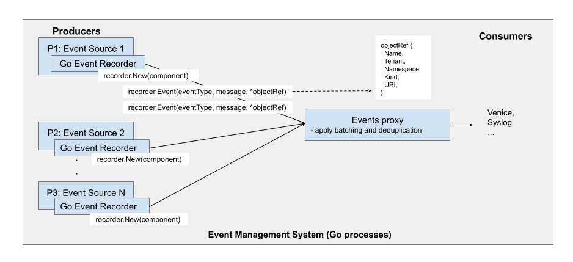

# Events Management System
This document captures how different events management components are designed and how to use it to record events.

Table of Contents
-----------------
* [Go Clients (Venice components + Agents)](#go-clients-venice-components--agents)
	* [Design components](#design-components)
		* [Event Source](#event-source)
		* [Event Recorder](#event-recorder)
		* [Event Proxy](#event-proxy)
	* [Venice components](#venice-components)
		* [How to add/update/delete event types?](#how-to-addupdatedelete-event-types)
		* [How to record events?](#how-to-record-events)
	* [Agents](#agents)
		* [How to add/update/delete event types?](#how-to-addupdatedelete-event-types-1)
		* [How to record events?](#how-to-record-events-1)
* [C++ Clients (Platform components + HAL/FTE)](#c-clients-platform-components--halfte)
	* [Design components](#design-components)
		* [Event Source](#event-source-1)
		* [Event Recorder](#event-recorder-1)
		* [Event Proxy](#event-proxy-1)
	* [How to add/update/delete event types?](#how-to-addupdatedelete-event-types-2)
	* [How to record events from NAPLES platform components and HAL/FTE?](#how-to-record-events-from-naples-platform-components-and-halfte)

## Go Clients (Venice components + Agents)



### Design components

#### Event Source
Any component (go process) in the system that generates an event.

* *Controller components* - CMD, NPM, etc.
* *Agents* - NMD, NetAgent, etc.

#### Event Recorder
Recorder creates the event with given information (severity, event type, message and reference object) and sends it to the events proxy server for further processing. Events that could not be sent to the proxy due to connection failure will be preserved in a file and replayed once the proxy is up.

#### Event Proxy
Proxy server receives events from all different sources and persists it. The call from the recorder terminates here. Further processing and delivery of the events are asynchronous. Events proxy applies deduplication and distributes the received events using the dispatcher library. Events proxy encapsulates the dispatcher and writers.

1. Event Dispatcher is a library used by the proxy for deduplication and distribution.Events are deduped for a given dedup interval. Any event that reoccurs after the interval will be consisdered a new event.Events are distributed to all registered writers in intervals (batch interval). Venice will be the default writer in MANAGED mode.

2. Writers (venice, syslog, etc.) will get the events from dispatcher. And it is responsible for writing it to their respective destination (venice, syslog).

Now, let us see how to use this service to record events. To record an event, the respective event type must exist in the system.

### Venice components

#### How to add/update/delete event types?

Event types are defined and managed in the service. Service proto (api/protos) needs to be updated to add/update/delete any event type.

e.g. `EventTypesV1` enum needs to be updated to reflect the new list of events.

***svc_cluster.proto***

```go
// list of V1 event types supported by the cluster service
enum EventTypesV1 {
    ElectionStarted   = 0; // Leader election started in the cluster
    ElectionCancelled = 1; // Leader election cancelled
    ElectionStopped   = 2; // Leader election stopped
    LeaderElected     = 3; // Leader elected for the cluster
    LeaderLost        = 4; // Node lost leadership during the election
    LeaderChanged     = 5; // Leader changed in the election
}

```

Once the proto is compiled, these event types will be available in `api/generated/{service}/svc_{service}_events.go`

e.g: `svc_cluster.proto` events will be in `/api/generated/cluster/svc_cluster_events.go`

#### How to record events?
1. All the event sources needs to provide source information (node-name and component) and a list of supported events to create the recorder. This information will be used when the event is recorded.

	***venice/cmd/cmd.go***

	```go
	import "github.com/pensando/sw/api/generated/cluster"
	...
	if _, err := recorder.NewRecorder(&recorder.Config{
		Source:       &monitoring.EventSource{NodeName: utils.GetHostname(), Component: globals.Cmd},
		EvtTypes:     cluster.GetEventTypes()); err != nil {
		log.Fatalf("failed to create events recorder, err: %v", err)
	}
	```

2. Start recording events - Once the recorder is created/initialized (singleton), users can use the library function `recorder.Event(...)` anywhere in the process to record events.

	***venice/cmd/services/leader.go***

	```go
	import "github.com/pensando/sw/api/generated/cluster"
	import "github.com/pensando/sw/venice/utils/events/recorder"
	...
	recorder.Event(cluster.ElectionStarted,
		monitoring.SeverityLevel_INFO,
		"Leader election started",
		nil)
	```

	- Event type will be validated against the list provided while creating the recorder.
	- Event source will be inherited from the underlying recorder.

### Agents
Upon recieving the status update from HAL/FTE, the agents are responsible for recording the appropriate events. Agents can also generate it's own events.

#### How to add/update/delete event types?
// TBD
// can use the same behavior as venice protos.

#### How to record events?
Same as the venice component.

1. Create events recorder.

	***nic/agent/cmd/nmd/main.go***

	```go
	import "github.com/pensando/sw/api/generated/cluster"
	...
	if _, err := recorder.NewRecorder(&recorder.Config{
		Source:       &monitoring.EventSource{NodeName: utils.GetHostname(), Component: globals.Nmd},
		EvtTypes:     cluster.GetEventTypes()); err != nil {
		log.Fatalf("failed to create events recorder, err: %v", err)
	}
	```

2. Start recording events.

	***nic/agent/nmd/state/smartnic.go***

	```go
	import "github.com/pensando/sw/api/generated/cluster"
	import "github.com/pensando/sw/venice/utils/events/recorder"
	...
	recorder.Event(cluster.NICAdmitted,
		monitoring.SeverityLevel_INFO,
		fmt.Sprintf("Smart NIC %s addmitted to the cluster",
		nic.GetName()),
		nic)
	```


## C++ Clients (Platform components + HAL/FTE)


### Design components

#### Event Source
Any component (c++ process) in the system that generates an event.

* *Datapath components* - HAL/FTE, etc.
* *Platform components* - Nicmgr, Linkmgmr, etc.

#### Event Recorder

Recorder init() initializes a shared memory with the given name and size.

Recorder event(...) records the event with given information (severity, event type, message, object kind and key) and writes it to the shared memory. Any incoming events will be discarded once the shared memory is full.

#### Event Proxy
Proxy will read the events from shared memory, massages the event (key conversion to venice object name), presists it in a file and distributes to venice/syslog. Events proxy applies deduplication and baching before distribution.

### How to add/update/delete event types?
Event types are defined and managed in the service protos. Each service can define it's own set of event types.

***nic/proto/hal/nw.proto***

```c++
enum EventTypes {
	option (gogoproto.goproto_enum_stringer) = false;
	option (gogoproto.enum_stringer) = true;
	NETWORK_CREATE_FAILED = 0;
	NETWORK_DELETE_FAILED = 1;
}
```

### How to record events from NAPLES platform components and HAL/FTE?

1. Create events recorder.

	```c++
	// in the main code
	#include "nic/utils/events/recorder/recorder.hpp"
	#include "gen/proto/nw.pb.h"
	.
	.
	events_recorder::init("fte_events", 1024, "FTE", nw::EventTypes_descriptor()); // 1024 bytes
	```

2. Start recording events.

	```c++
	#include "nic/utils/events/recorder/recorder.hpp"
	#include "gen/proto/nw.pb.h"
	#include "gen/proto/types.pb.h"
	.
	.
	events_recorder::event(
		types::INFO,                                         // severity
		nw::NETWORK_CREATE_FAILED,                           // event type
		"Network",                                           // object_kind
		network_key,                                         // kh:: NetworkKeyHandle
		"network creation failed on node %s", "naplesxxxx"); // message...
	```