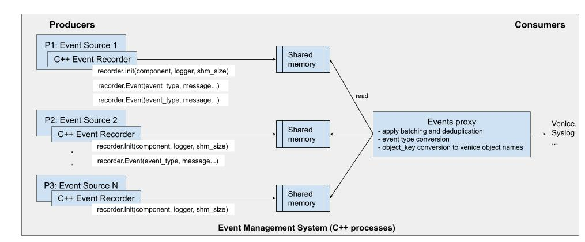

# Events Management System
This document captures how different events management components are designed and how to use it to record events.

[High-Level Architecture](https://docs.google.com/document/d/10X8YgG6tVaHRTfvHnTn9S6MORo5hNJ0k2AcD-Eomh18)

Table of Contents
-----------------
  * [Sample Event](#sample-event)
  * [Event Types](#event-types)
     * [How to add/update/delete event types category?](#how-to-addupdatedelete-event-types-category)
     * [How to add/update/delete event types?](#how-to-addupdatedelete-event-types)
  * [Go Clients (Venice components + Agents)](#go-clients-venice-components--agents)
     * [Design components](#design-components)
        * [Event Source](#event-source)
        * [Event Recorder](#event-recorder)
        * [Event Proxy](#event-proxy)
     * [How to record events from venice components?](#how-to-record-events-from-venice-components)
     * [How to record events from NAPLES agents?](#how-to-record-events-from-naples-agents)
  * [C++ Clients (Platform components + HAL/FTE)](#c-clients-platform-components--halfte)
     * [Design components](#design-components-1)
        * [Event Source](#event-source-1)
        * [Event Recorder](#event-recorder-1)
        * [Event Proxy](#event-proxy-1)
     * [How to record events from NAPLES platform components and HAL/FTE?](#how-to-record-events-from-naples-platform-components-and-halfte)

## Sample Event
```
{
    "kind": "Event",
    "meta": {
        "name": "99607d4c-15a2-495b-b37a-41a0fb098134",
        "tenant": "default",
        "namespace": "default",
        "generation-id": "",
        "uuid": "99607d4c-15a2-495b-b37a-41a0fb098134",
        "labels": {
            "_category": "Monitoring"
        },
        "creation-time": "2020-04-06T15:42:13.262814429Z",
        "mod-time": "2020-04-06T15:42:13.262814429Z",
        "self-link": "/events/v1/events/99607d4c-15a2-495b-b37a-41a0fb098134"
    },
    "severity": "warn",
    "type": "DSC_NOT_ADMITTED",
    "message": "DSC for host [sim_host1035] not admitted.",
    "category": "cluster",
    "object-ref": {
        "kind": "Node",
        "name": "20.0.1.61"
    },
    "source": {
        "component": "pen-npm",
        "node-name": "20.0.1.61"
    },
    "count": 1
}

```

## Event Types
All the event types are maintained in `sw/events/protos/eventtypes.proto` along with it's category and severity. When an event is recorded, category and severity will be automatically populated based on the event type. Events types are compiled for both go and c++ clients.

### How to add/update/delete event types category?

Update `Category` enum in `/sw/events/protos/attributes.proto` and compile the protos using `make` from both `/sw/events` and `/sw/nic` directories. Also, make sure to update `Category_normal` map in `sw/events/generated/eventattrs/attributes.pb.ext.go`. (TODO: @Yuva, auto-generate this)

### How to add/update/delete event types?

Update `EventTypes` enum in `/sw/events/protos/eventtypes.proto` and compile the proto using following commands:

1. `make` from `/sw/events`
2. `make` from `/sw/nic`
3. `make ui-autogen` from `/sw`

## Go Clients (Venice components + Agents)


### Design components

#### Event Source
Any component (go process) in the system that generates an event.

* *Controller components* - CMD, NPM, etc.
* *Agents* - NMD, NetAgent, etc.

#### Event Recorder
Recorder creates the event with given information (event type, message and reference object) and sends it to the events proxy server for further processing. Events that could not be sent to the proxy due to connection failure will be preserved in a file and replayed once the proxy is up.

#### Event Proxy
Proxy server receives events from all different sources and persists it. The call from the recorder terminates here. Further processing and delivery of the events are asynchronous. Events proxy applies deduplication and distributes the received events using the dispatcher library. Events proxy encapsulates the dispatcher and exporters.

1. Event Dispatcher is a library used by the proxy for deduplication and distribution.Events are deduped for a given dedup interval. Any event that reoccurs after the interval will be considered a new event. Events are distributed to all registered exporters in intervals (batch interval). Venice will be the default exporter in MANAGED mode.

2. Exporters (venice, syslog, etc.) will get the events from dispatcher. And it is responsible for writing it to their respective destination (venice, syslog).

Now, let us see how to use this service to record events. To record an event, the respective event type must exist in the system.

### How to record events from venice components?
1. All the event sources need to provide source information (i.e. name of the component generating the event). This information will be used when the event is recorded.

	***venice/cmd/cmd.go***

	```go
	import "github.com/pensando/sw/venice/utils/events/recorder"
	...
	if _, err := recorder.NewRecorder(&recorder.Config{Component: globals.Cmd); err != nil {
		log.Fatalf("failed to create events recorder, err: %v", err)
	}
	```

2. Start recording events - Once the recorder is created/initialized (singleton), users can use the library function `recorder.Event(...)` anywhere in the process to record events.

	***venice/cmd/services/leader.go***

	```go
	import "github.com/pensando/sw/events/generated/eventtypes"
	import "github.com/pensando/sw/venice/utils/events/recorder"
	...
	recorder.Event(eventtypes.ELECTION_STARTED, "Leader election started", nil)
	...
	```

	- Event source(component) will be inherited from the underlying recorder.

### How to record events from NAPLES agents?
Upon receiving the status update from HAL/FTE, the agents are responsible for recording the appropriate events. Agents can also generate it's own events.

1. Create events recorder.

	***nic/agent/cmd/nmd/main.go***

	```go
	import "github.com/pensando/sw/venice/utils/events/recorder"
	...
	if _, err := recorder.NewRecorder(&recorder.Config{Component: globals.Nmd); err != nil {
		log.Fatalf("failed to create events recorder, err: %v", err)
	}
	...
	```

2. Start recording events.

	***nic/agent/nmd/state/smartnic.go***

	```go
	import "github.com/pensando/sw/events/generated/eventtypes"
	import "github.com/pensando/sw/venice/utils/events/recorder"
	...
	recorder.Event(eventtypes.NIC_ADMITTED, fmt.Sprintf("Smart NIC %s admitted to the cluster", nic.GetName()), nil)
	...
	```

## C++ Clients (Platform components + HAL/FTE)



### Design components

#### Event Source
Any component (c++ process) in the system that generates an event.

* *Datapath components* - HAL/FTE, etc.
* *Platform components* - Nicmgr, Linkmgr, etc.

#### Event Recorder

Recorder init() initializes a shared memory with the given component name and size.

Recorder event(...) records the event with given information (event type, message) and writes it to the shared memory. Any incoming events will be discarded once the shared memory is full.

#### Event Proxy
Proxy will read the events from shared memory, massages the event (key conversion to venice object name), persists it in a file and  distributes it to venice/syslog. Events proxy applies deduplication and batching before distribution.

### How to record events from NAPLES platform components and HAL/FTE?

1. Create events recorder.

	```c++
	// in the main code
	#include "nic/utils/events/recorder/recorder.hpp"
	...
    // initialize events recorder
    g_linkmgr_svc.recorder = events_recorder::init(
        "linkmgr", // component generating the event
        std::shared_ptr<logger>(hal::utils::hal_logger()));
	...
	```

2. Start recording events using the recorder instance (from step 1).

	```c++
	#include "gen/proto/eventtypes.pb.h"
	#include "nic/utils/events/recorder/recorder.hpp"
	...
	recorder->event(
		eventypes::LINK_UP,                           // event type
		"link %s is up, "linkXXXXXX");                // message...
	...
	or
	...
	recorder->event_with_ref(
			eventypes::LINK_UP,                           // event type
			"Network",                                    // object_kind
			network_key,                                  // kh:: NetworkKeyHandle
			"link %s is up, "linkXXXXXX");                // message...
	...
	```